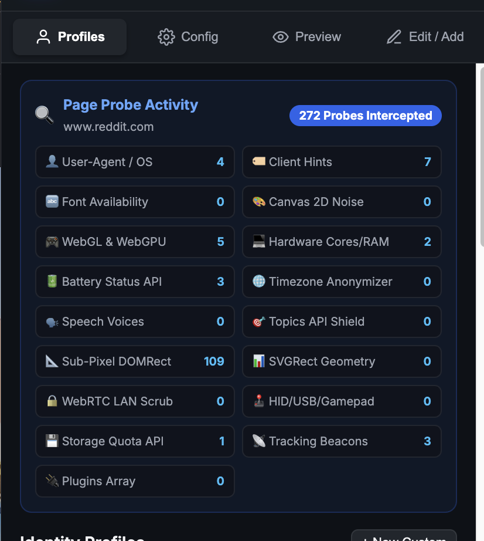
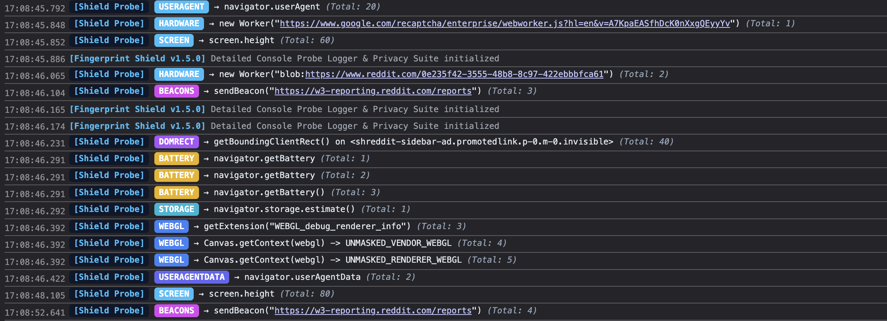

# Header & Fingerprint Shield

Header & Fingerprint Shield is a browser extension built with Manifest V3 for Chromium-based browsers (Google Chrome, Brave, Microsoft Edge). It provides HTTP header customization, browser fingerprint protection, beacon blocking, and live DevTools console probe logging against fingerprinting engines like CreepJS, FingerprintJS, and Tembrica.

---

## Key Features

### 1. Live DevTools Console Probe Logger

- Logs every script attempt to measure or query DOM element dimensions (`getBoundingClientRect`), fonts (`measureText`), WebGL shaders, WebGPU adapters, AudioContext buffers, Storage Quotas, or WebRTC offers directly into the browser DevTools Console.
- Color-coded badges with category tags, target details, and inspectable JSON payload objects.

### 2. Profile Switching & Dynamic Headers
- **Sticky First-Party, Random Third-Party (`PER_SITE_3RD_RANDOM`)**: Default mode. First-party site requests use a sticky assigned browser profile to preserve logins and cookies, while third-party requests (CDNs, ad networks, trackers) receive randomized identities on every domain.
- **Sticky Per Site (`STICKY_PER_SITE`)**: Assigns a consistent identity per top-level domain.
- **Random Per Tab (`RANDOM_PER_TAB`)**: Generates a new identity per tab.
- **Global Profile (`GLOBAL`)**: Applies a single chosen profile across all web requests.
- Implemented via dynamic `declarativeNetRequest` rules to modify `User-Agent`, `Sec-CH-UA`, `Sec-CH-UA-Mobile`, and `Sec-CH-UA-Platform` HTTP headers at the network layer.

### 3. URL Tracking Parameter Stripper (`Clean URLs`) & Referer Trimming
- **Network Level**: DeclarativeNetRequest redirect rule automatically removes tracking query parameters (`utm_source`, `utm_medium`, `utm_campaign`, `fbclid`, `gclid`, `msclkid`, `twclid`, `igshid`, `yclid`, `mc_eid`, `_ga`) on outbound navigation requests.
- **DOM Level**: `history.replaceState` removes tracking query parameters from the address bar upon page load.
- **Cross-Site Referer Trimming**: Removes `Referer` headers on third-party sub-resource requests (`domainType: "thirdParty"`).

### 4. Comprehensive Beacon Suite (sendBeacon, fetch keepalive, ping, pixels & iframes)
- **`navigator.sendBeacon`**: Returns `true` to trick fingerprinters while transmitting zero bytes over the network (toggleable for same-origin vs 3rd-party).
- **`fetch` keepalive**: Mutes `fetch(url, { keepalive: true })` tracking payloads.
- **HTML `<a ping="...">`**: Strips anchor `ping` tracking attributes.
- **Micro Images & iFrames**: Filters 1x1 tracking pixels and hidden micro-iframes.

### 5. Navigator & Client Hints Spoofing
- Modifies JavaScript navigator properties: `userAgent`, `appVersion`, `platform`, `vendor`, `oscpu`, `hardwareConcurrency`, `deviceMemory`, `maxTouchPoints`, and `storage.estimate()` disk quota.
- Supports Sec-CH-UA Client Hints via `navigator.userAgentData` and `navigator.userAgentData.getHighEntropyValues()`.

### 6. WebGL & WebGPU Shield
- Spoofs WebGL vendor and renderer strings (`WEBGL_debug_renderer_info`).
- Overrides WebGPU `navigator.gpu` (`requestAdapter` / `requestAdapterInfo`).
- Scrubs hardware comments from `WEBGL_debug_shaders`.
- Advanced WebGL Shield: Spoofs Windows D3D extension lists, standardizes shader precision formats, sets max texture limits (16384), and adds 1-bit LSB noise to `readPixels()`.

### 7. Web Worker & ServiceWorker Isolation
- Intercepts `Worker`, `SharedWorker`, Blob Workers, and `ServiceWorkerGlobalScope` registrations via constructor and `URL.createObjectURL` hooks.
- Ensures worker threads execute inside a spoofed environment, preventing worker-based host OS and GPU leaks.

### 8. Sub-Pixel DOMRect, SVGRect & Audio Noise
- **DOMRect Sub-Pixel Noise**: Adds microscopic float noise ($\pm 0.00001\text{px}$) to `Element.prototype.getBoundingClientRect` and `Range.prototype.getClientRects`, defeating CreepJS element rendering math fingerprinting.
- **SVGRect Geometry Noise**: Applies float noise to `SVGGraphicsElement.prototype.getBBox` and `SVGTextContentElement.prototype.getComputedTextLength`, neutralizing SVG text rendering math tests.
- **AudioContext Noise**: Applies subtle micro-noise to `AnalyserNode.prototype.getFloatFrequencyData` and `AudioBuffer.prototype.getChannelData` to randomize WebAudio fingerprint hashes.

### 9. Smart WebRTC Private LAN IP Scrubbing
- Intercepts `RTCPeerConnection.prototype.createOffer` and `createAnswer`.
- Scrubs private LAN IPv4 (`192.168.x.x`, `10.x.x.x`) and local IPv6 (`fe80::`) candidate strings while keeping public STUN/TURN candidates intact for Google Meet, Zoom, and Webex calls.

### 10. Multi-Monitor, Screen Details & Peripheral Neutering
- Forces `screen.isExtended = false` and overrides `getScreenDetails()` to hide multi-monitor configurations.
- Overrides `navigator.getGamepads()` to return `[null, null, null, null]`.
- Stubs WebBluetooth, WebHID, and WebUSB to reject unauthorized hardware enumeration.

### 11. Anti-Font Fingerprinting & OS Alignment
- Suppresses Mac-signature fonts (`Helvetica Neue`, `Geneva`, `Monaco`, `Menlo`, `Galvji`, `Luminari`, etc.) when running a Windows profile.
- Simulates presence of Windows-signature fonts (`Segoe UI`, `Calibri`, `Consolas`).
- Deterministically marks a random selection of uncommon fonts as uninstalled per profile seed.
- Applies sub-pixel float noise to `CanvasRenderingContext2D.prototype.measureText`.

### 12. Same-Offset Timezone Anonymizer
- Intercepts `Intl.DateTimeFormat.prototype.resolvedOptions`.
- Maps the real timezone to an equivalent same-offset IANA timezone (for example, mapping `Europe/Athens` to `Europe/Helsinki`).
- Anonymizes exact city location while maintaining zero offset difference to prevent timezone mismatch mismatch.

### 13. Google Privacy Sandbox Topics API Randomizer
- Overrides `document.browsingTopics()` to return 3 randomized topics from the Google 629-topic taxonomy, poisoning ad profiling.

---

## Installation

1. Open Chrome or Brave and navigate to `chrome://extensions` or `brave://extensions`.
2. Enable **Developer mode** using the toggle in the top-right corner.
3. Click **Load unpacked**.
4. Select the directory containing this repository.

---

## File Structure

- `manifest.json`: Extension manifest defining permissions, declarative network rules, background service worker, and content scripts.
- `background.js`: Service worker managing declarativeNetRequest rules and probe statistics.
- `content_isolated.js`: Content script executing in the ISOLATED world, bridging extension storage to page context.
- `content_inject.js`: Content script executing in the MAIN world, handling DOM API overrides and worker interception.
- `profiles.js`: Preset identity profiles (Windows Edge, Chrome, Linux).
- `popup/`: Popup UI html, CSS, and controller logic for user configuration and live monitoring.

---

## License

MIT License.
